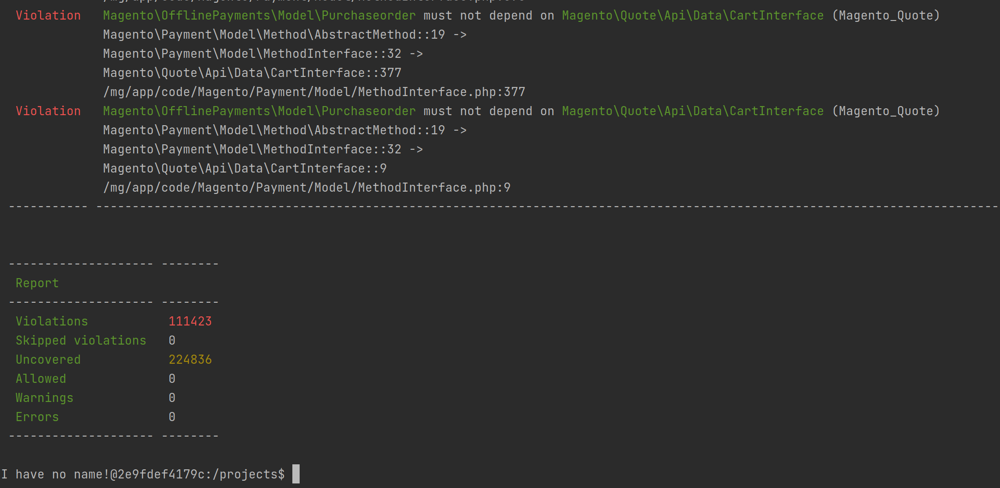

## Simple example of checking magento modules dependencies with Deptrac

### How to use

- Generate `deptrac.layers.yaml` with `./magetrac.php /mg/app/code`
- Run deptrac for 

### Deptrac config
https://qossmic.github.io/deptrac/
```yaml
imports:
  - deptrac.layers.yaml
deptrac:
  paths:
    - /{path-to-your-magento}/app/code/
```

### Run for your app/code folder
```bash
./magetrac.php /mg/app/code && ./deptrack
```

### Example run for all magento 2 repo



- One can see that the module Magento_OfflinePayments does not contain the module Magento_Quote in its dependencies list despite using Magento\Quote classes

### Generate graph
```bash
./deptrac analyze -f graphviz-dot -o check-result.dot
./deptrac analyze -f graphviz-image -o check-result.png
```
